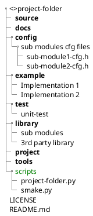

# Project script tools

Automated standard project folder structure generation python scripts.



## project-folder

[project-folder.py](/scripts/project-folder.py) : Generate standard folder structure in initial project workplace.

### Usage 
```shell
> python3 project-folder [-d DIRECTORY]

[-d DIRECTORY] -- required. Project folder structure create location
```


### Example 
```shell
# Create folders in previews path
> python3 project-folder.py -d .. 
```

## smake

[smake.py](/scripts/smake.py) : Generate C/C++ source and header files.


### Usage 
```shell
> python3 smake [-f FILE_NAME] [-d DIRECTORY] [-s SMART]

[-f FILE_NAME] -- required.
[-d DIRECTORY] -- optional. Source file create location
[-s SMART]     -- optional. Source file create in source and config folder 
                  as per project-folder.py folder structure
```

### Example 
```shell
# Create source template file in current folder
> python3 project-folder.py -f app

# Create source template file in previews path
> python3 project-folder.py -f app -d ..

# Create source template file in previews path source and config folders
> python3 project-folder.py -f app -d .. -s Y
```